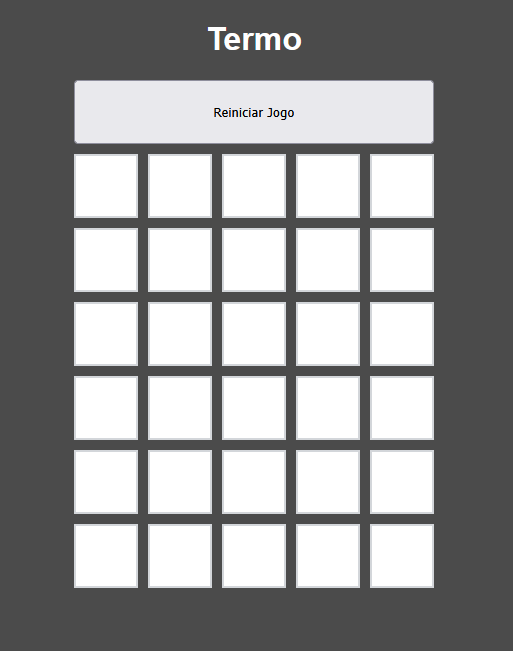

🟩 Termo Clone

Recriação do popular jogo de palavras Termo feito com JavaScript, HTML e CSS puro — sem frameworks, sem dependências.

🎮 Sobre o Projeto
Clone do Termo, o famoso jogo brasileiro de adivinhar palavras. O objetivo é descobrir a palavra secreta de 5 letras em até 6 tentativas, com dicas visuais a cada chute.
Desenvolvido como exercício de front-end, utilizando apenas as tecnologias base da web.

🕹️ Como Jogar

Digite uma palavra de 5 letras e pressione Enter
As cores das letras revelam dicas:

CorSignificado🟩 VerdeLetra correta no lugar certo🟨 AmareloLetra existe, mas está no lugar errado⬜ CinzaLetra não está na palavra

Você tem 6 tentativas para acertar a palavra!

🛠️ Tecnologias

HTML5
CSS3
JavaScript (Vanilla)
